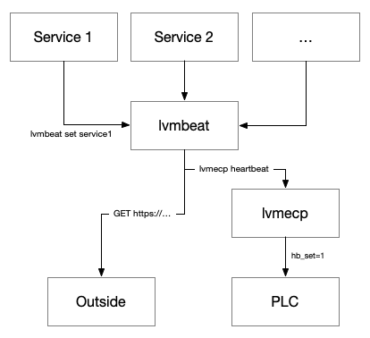

# lvmbeat

`lvmbeat` provides two different utilities:

- As an actor, it functions as a middleware for "heartbeat" messages between different elements within the LVM operations system and the ECP dome system.
- It also includes a service that runs outside LCO and receives a heartbeat from the observatory, alerting when it does not, which indicates a problem with LCO connecting to the internet or a major networking issue.

## Heartbeat middleware

The dome PLC includes a heartbeat feature. If a certain Modbus variable has not been set for a minute by an external source, the PLC understand that the high level software is not running properly and it will close the dome.

`lvmbeat` provides a middleware that monitors all the heartbeats from critical components that must be running for the dome to be operated in robotic mode (currently only the Overwatcher, but potentially others like the `lvm-api`). Every few seconds, `lvmbeat` reviews all the heartbeats that it has received in the last and, if all the necessary heartbeats are present, it emits an `lvmecp heartbeat` command that will write the PLC heartbeat command, keeping the dome open. The following diagram shows the architecture of the system:



Note that the `lvmbeat` actor does *not* have a loop that emits the heartbeat to the ECP on a loop. Heartbeats are emitted when the `lvmbeat` actor receaves a `set` command from one of the clients. A cutoff time is in place to avoid sending commands to `lvmecp` too frequently.

In addition to this, `lvmbeat` regularly calls an API route outside LCO to indicate that it is alive and that the connection from the observatory to the internet is working.

### Configuration file

The configuration file `config.yaml` looks like

```yaml
actor:
  name: lvmbeat
  host: localhost
  port: 5672
  log_dir: /data/logs/lvmbeat

timeout: 30

outside_monitor:
  url: null
  interval: 15
  send_email_after: 300

heartbeats:
  - name: overwatcher
    critical: true
```

`timeout` sets how long after one of the critical heartbeat has *not* been received, the `lvmbeat` actor will stop emitting commands to `lvmecp`.

To add a new heartbeat, simply add it to the `heartbeats` section and then have the client responsible for it send `lvmbeat set <heartbeat_name>` every few seconds (but more frequently than `timeout`).

The `outside_monitor` section defines the outside URL that the actor will call every `outside_monitor.interval`. `send_email_after` indicates how long the external monitor service will wait after it has not received a heartbeat to send an alert email. The `url` value must be replaced with the URL of the external monitor service. The URL can also be defined by setting the environment variable `LVMBEAT_OUTSIDE_MONITOR_URL`.

### Status command

```console
lvmbeat status
16:32:29.736 lvmbeat : {
    "heartbeats": {
        "overwatcher": {
            "current": false,
            "last_seen": null
        }
    },
    "last_emitted_ecp": null,
    "last_emitted_outside": "2024-12-26T16:32:25.935047Z",
    "network": {
        "lco": true,
        "outside": true
    }
}
```

The actor accepts a `status` command that returns the last time each one of the heartbeats was received, the last time heartbeats were emitted to `lvmecp` and to the external monitor. Finally, it reports whether the connection to the observatory (from the LVM subnet) and the outside world is working.

## External monitor

The external monitor runs outside LCO. It provides a simple API that lets the `lvmbeat` actor running at LCO indicate that it is alive and can connect. When this connection has not been established for a certain amount of time, the external monitor sends an email to the LVM team alerting that the connection to LCO may be down.

The external monitor must run in such a way that it can provide a semi-static ingress point to the application, and must have access to an SMTP server to send the emails. We are currently deploying the monitor as an Azure container app.

The following routes are available in the API:

- `GET /heartbeat`: sets the internal heartbeat. Usually called by the `lvmbeat` actor from LCO.
- `GET /status`: returns the last time the heartbeat was received, whether the alert is active, and whether the monitor is enabled.
- `GET /enable`: enables the monitor.
- `GET /disable`: disables the monitor. When disabled, the monitor will keep track of the heartbeats but will not send an alert email.
- `GET /email-test`: sends a test alert email. Useful to test the SMTP server configuration.
- `GET /version`: returns the version of the `lvmbeat` code.

## Deployment

There are three elements in the heartbeat ecosystem that need to be deployed: the `lvmbeat` actor, the `lvmbeat` external monitor, and the `lvmecp` actor. In principle they can be deployed in any order, but unless done quickly this is likely to cause false alert emails and the dome to close (if open).

The following sequence is the recommended deployment order:

- Close the dome.
- Deploy the `lvmecp` actor.
- Deploy the `lvmbeat` actor.
- Deploy the external monitor service.
- If the ingress host to the external monitor does not match the one in the `lvmbeat` configuration, siable the external monitor, update the configuration, restart the actor, and enable the external monitor again.

### `lvmecp` and `lvmbeat` actor deployment

The actors are deployed in the LVM Kubernetes cluster like other actors and no special considerations must be taken into account. However, `lvmecp` will use [lvmopstools](https://github.com/sdss/lvmopstools) to emit Slack notifications and the correct value for the `$LVMOPSTOOLS_CONFIG_FILE` environment variable must be set in the deployment.

### External monitor deployment

This instructions assume that we are deploying the external monitor in an Azure cloud environment. The app can also be deployed in a self-hosted environment with the same procedure, as long as an SMTP server is available.

#### Initial setup

Before deploying the app, a number of services need to be set up in Azure. This should be a one-off operation. The majority of these operations can be performed either through the Azure portal or the Azure CLI.

1. Create a resource group. This is a logical container for resources in Azure. The following command creates a resource group named `sdss` in the `westus` region:

    ```bash
    az group create --name sdss --location westus
    ```

2. Create a communication email resource with an Azure-provided email domain, add a communication resource, and register an application. All that is explained [here](https://learn.microsoft.com/en-us/azure/communication-services/quickstarts/email/send-email-smtp/smtp-authentication). Note that you'll also need to follow the steps in the prerequisites section (the client secret is not necessary) and to create a secret in the Microsoft Entra application. After this, the SMTP details will be:

    - Host: `smtp.azurecomm.net`
    - Port: 587
    - TLS: yes
    - Username: `<Azure Communication Services Resource name>.<Microsoft Entra Application ID>.<Microsoft Entra Tenant ID>`
    - Password: the value of the secret created in the Microsoft Entra application

#### Container app deployment

1. Build the container image. The `lvmbeat` repository workflows build two images: `lvmbeat` and `lvmbeat-monitor`. The `lvmbeat` image is the actor that runs at LCO and the `lvmbeat-monitor` is the external monitor. Both are pushed the the `ghcr.io/sdss` registry.

2. Deploy the application as a container app in Azure. You can do it from the portal, but this command should work:

    ```bash
    az containerapp up \
        --name lco-monitor \
        --image ghcr.io/sdss/lvmbeat-monitor \
        --ingress external \
        --target-port 80 \
        --resource-group <resource-group> \
        --env-vars LVMBEAT_EMAIL_RECIPIENTS="LVM Critical Alerts <lvm-critical@sdss.org>" \
            LVMBEAT_EMAIL_FROM_ADDRESS="LVM Critical Alerts <do-not-reply-address>" \
            LVMBEAT_EMAIL_REPLY_TO="lvm-critical@sdss.org" \
            LVMBEAT_EMAIL_HOST="smtp.azurecomm.net" \
            LVMBEAT_EMAIL_PORT="587" \
            LVMBEAT_EMAIL_TLS="1" \
            LVMBEAT_EMAIL_USERNAME="<smtp-username>" \
            LVMBEAT_EMAIL_PASSWORD="<smtp-password>" \
            LVMBEAT_SEND_EMAIL_AFTER="300"
    ```

    where you must replace `<smtp-username>` and `<smtp-password>` with the values obtained from the Azure Communication Services resource. The `<do-not-reply-address>` email can be found in the `MailFrom addresses` sections of the provisioned domain in the email communication service.

    When the service finishes deploying it will return the ingress URL. It can also be found in the Ingress section of the container app in the Azure portal.

3. Test the service by calling the `/status` route:

    ```bash
    curl -L -X GET http://<ingress-url>/status
    ```

    The response should be something like

    ```json
    {
        "last_seen": "2024-12-26T16:32:25.935047Z",
        "enabled": true,
        "active": false
    }
    ```

    You can temporarily disable the monitor by calling the `/disable` route.

4. Test the SMTP configuration by calling the `/email-test` route:

    ```bash
    curl -L -X GET http://<ingress-url>/email-test
    ```

    You should receive an email via the `lvm-critical@sdss.org` mailing list.

5. Make sure the monitor is enabled and that the `lvmbeat` actor at LCO is calling the `/heartbeat` route.

6. You may want to use the Azure portal to make sure the deployment can only create one replica of the service, although it never seems to create more than one.

If you need to redeploy the app, you can simply delete the container app with

```bash
az containerapp delete --name lco-monitor --resource-group <resource-group>
```

and then redeploy it with the `az containerapp up` command. Alternatively you can use the `update` command which will create a new revision and then switch the traffic to it when ready.

```bash
az containerapp update --name lco-monitor --image ghcr.io/sdss/lvmbeat-monitor:latest --resource-group <resource-group> --max-replicas 1
```

This will work if you're chaning something in your deployment (for example changing the tag of the image), but if you're just trying to re-pull the latest image, the container won't be restarted. To do that you'll need to go to the Azure portal and restart the revision, or do

```bash
az containerapp revision list -n lco-monitor -g <resource-group> -o table
```

to get the revision number and then

```bash
az containerapp revision restart -n lco-monitor -g <resource-group> --revision <revision-number>
```

More details on how to manage revisions can be found [here](https://learn.microsoft.com/en-us/azure/container-apps/revisions-manage).

The ingress URL remains constant only as long as the revision does not change, which means that in most cases when something is actually changed in the deployment, the URL will change.
